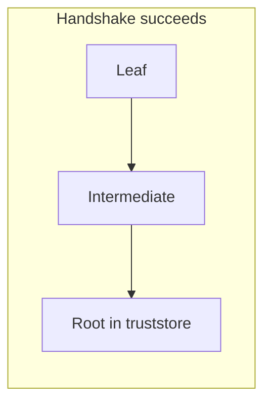
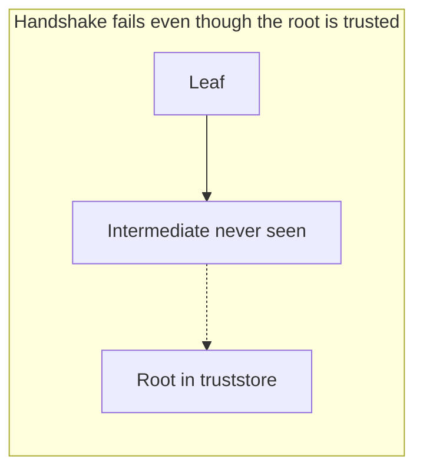

# SSL Trust Root Demo

Spring Boot **3.5.16** / Java **21** demonstration of a question that comes up
on every outbound HTTPS integration:

> If the remote API presents a certificate chain of root, intermediate, and
> leaf, do I only need to trust the root in the Java client?

**Yes — provided the server actually sends a complete chain.** This project
proves both sides of that statement with live TLS handshakes.

## What Java actually does

During a TLS handshake the client does **not** look at the leaf and say "I
trust this host". It runs **PKIX path building**:

```
leaf  →  intermediate(s) sent by the server  →  a trust anchor in the client's truststore
```

The truststore holds **trust anchors**, usually the Root CA. The intermediate
and the leaf belong in the **handshake**, not in the truststore.





Browsers often download a missing intermediate via the certificate's AIA
(Authority Information Access) URL. **The JDK does not do that by default.**
That is why a URL that opens in Chrome can still fail from Spring
`RestClient` / `RestTemplate` / `WebClient` with:

```text
javax.net.ssl.SSLHandshakeException: PKIX path building failed
sun.security.provider.certpath.SunCertPathBuilderException:
unable to find valid certification path to requested target
```

## What this app does

On startup it:

1. Generates a throwaway PKI: **Demo Root CA → Demo Intermediate CA → localhost leaf**.
2. Starts two local HTTPS "upstream APIs" that share the same leaf key:
   - **full-chain** — keystore chain `[leaf, intermediate]` (correct server config)
   - **leaf-only** — keystore chain `[leaf]` (classic misconfiguration)
3. Calls both of them with a Spring `RestClient` whose truststore contains
   **only the root**.
4. Repeats the leaf-only call with two workarounds (trust the intermediate;
   pin the leaf).

The Spring Boot process itself listens on plain HTTP `8080` so you can inspect
the results. The TLS experiment is the **outbound** call.

| Scenario | Client truststore | Server sends | Handshake |
| --- | --- | --- | --- |
| `trust-root-full-chain` | Root only | leaf + intermediate | **succeeds** |
| `trust-root-leaf-only` | Root only | leaf only | **fails (PKIX)** |
| `workaround-trust-intermediate` | Root + intermediate | leaf only | succeeds (brittle) |
| `workaround-pin-leaf` | Leaf itself | leaf only | succeeds (very brittle) |

## Run it

Requires JDK 21 and Maven 3.8+.

```bash
mvn test
mvn spring-boot:run
```

Then:

```bash
curl -s http://127.0.0.1:8080/api/ssl-demo | python -m json.tool
curl -s http://127.0.0.1:8080/api/ssl-demo/full-chain
curl -s http://127.0.0.1:8080/api/ssl-demo/leaf-only
curl -s http://127.0.0.1:8080/api/ssl-demo/pki
```

Startup logs print the same report. Look for `handshake succeeded : true`
on the full-chain scenario and `PKIX` / `unable to find valid certification path`
on the leaf-only scenario.

## Mapping this to a real Spring Boot service

`server.ssl.*` in `application.yml` is the **incoming** connector (this app
acting as an HTTPS server). Outbound calls use a **different** SSL context.

Production equivalent of "trust the root only":

```bash
keytool -importcert -trustcacerts \
  -alias org-root \
  -file org-root.crt \
  -keystore truststore.p12 \
  -storetype PKCS12
```

```yaml
# Spring Boot 3.1+ SSL bundle, then point RestClient/WebClient at the bundle
spring:
  ssl:
    bundle:
      jks:
        upstream:
          truststore:
            location: file:/etc/ssl/truststore.p12
            password: changeit
```

If Java still cannot build a path after the root is imported, inspect what the
server actually sends:

```bash
openssl s_client -connect api.example.com:443 -showcerts
```

You want to see the leaf **and** the intermediate. If you only see the leaf,
fix the server (`ssl_certificate` should be `fullchain.pem`, or the Java
keystore entry should be created with the certificate chain) rather than
importing every intermediate into every client.

## Project layout

```
src/main/java/com/example/ssltrust/
  pki/          generates Root → Intermediate → Leaf
  tls/          KeyStore / SSLContext / PKIX helpers
  upstream/     two JDK HttpsServer instances with different chains
  client/       RestClient whose truststore holds only chosen anchors
  demo/         the four handshake scenarios
  web/          REST API over those scenarios
```

The comments in `HandshakeDemoService`, `TlsSupport`, and `PkixPathBuilder`
walk through the concept next to the code that implements it.
