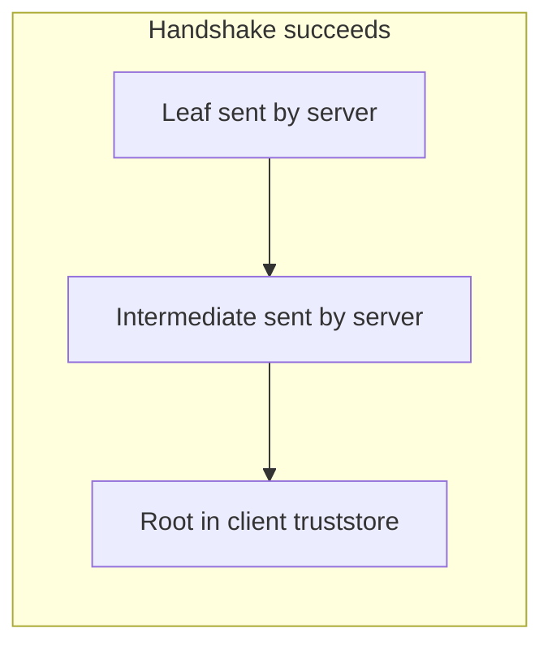
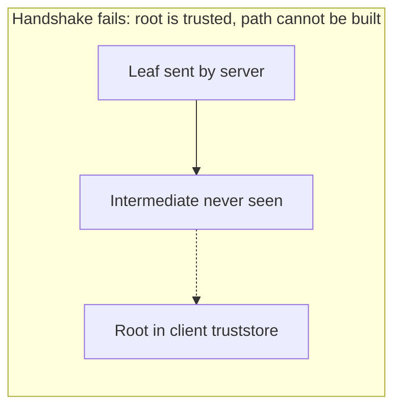
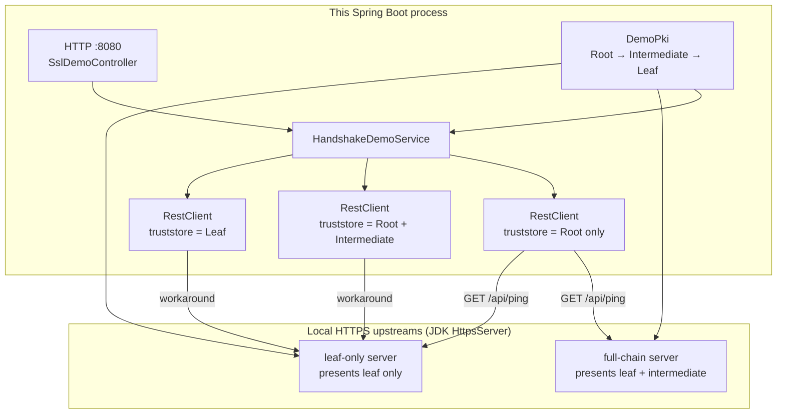
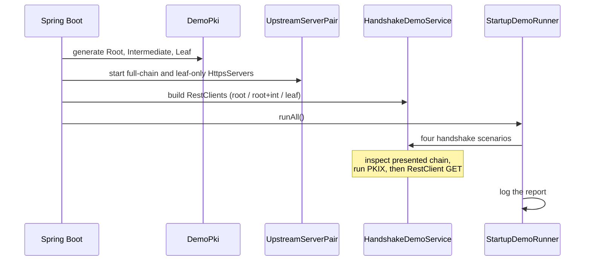

# SSL Trust Root Demo

Spring Boot **3.5.16** / Java **21** sample that answers a question every outbound
HTTPS integration eventually hits:

> If a remote API presents a certificate chain of root, intermediate, and leaf,
> do I only need to trust the root in the Java client?

**Yes — but only if the server actually sends a complete chain.** This project
proves both sides of that statement with live TLS handshakes, not diagrams
alone. A Spring Boot REST API trusts only a generated Root CA, then calls two
local HTTPS "upstream" APIs that share the same leaf key:

- one presents **leaf + intermediate** → handshake **succeeds**
- one presents **leaf only** → handshake **fails** with
  `PKIX path building failed` even though the root is trusted

The failure is the interesting result. It is the same error people see when a
URL opens in Chrome but `RestClient` / `RestTemplate` / `WebClient` cannot
connect.

---

## Contents

1. [Concepts](#concepts)
   - [What a certificate chain is](#what-a-certificate-chain-is)
   - [Truststore vs. handshake chain](#truststore-vs-handshake-chain)
   - [PKIX path building](#pkix-path-building)
   - [Why browsers succeed when Java fails](#why-browsers-succeed-when-java-fails)
   - [What still has to be true besides trust](#what-still-has-to-be-true-besides-trust)
2. [What this application does](#what-this-application-does)
3. [Detailed design of the code samples](#detailed-design-of-the-code-samples)
   - [Process layout](#process-layout)
   - [Startup sequence](#startup-sequence)
   - [Package and class map](#package-and-class-map)
   - [How the PKI is generated](#how-the-pki-is-generated)
   - [How the two upstreams differ](#how-the-two-upstreams-differ)
   - [How the Spring client is built](#how-the-spring-client-is-built)
   - [The four handshake scenarios](#the-four-handshake-scenarios)
   - [REST API surface](#rest-api-surface)
   - [Tests](#tests)
4. [How to run it locally](#how-to-run-it-locally)
5. [Mapping this to a real Spring Boot service](#mapping-this-to-a-real-spring-boot-service)
6. [Troubleshooting](#troubleshooting)

---

## Concepts

### What a certificate chain is

Public HTTPS almost never uses a single self-signed certificate. A typical
server identity is a three-tier hierarchy:

```
Demo Root CA                  self-signed trust anchor
      │
      ▼
Demo Intermediate CA          signed by the root
      │
      ▼
localhost leaf                signed by the intermediate; this is the server cert
```

Each certificate is a signed statement: "the issuer attests that this public
key belongs to this subject." The leaf is the certificate the server uses to
prove it is `localhost` (or `api.example.com` in production). The intermediate
exists so the root's private key can stay offline. The root is the only
certificate the client is expected to already have.

That is the same shape as a public CA (Let's Encrypt, DigiCert) and as most
corporate private PKIs.

### Truststore vs. handshake chain

These two stores are not the same thing, and mixing them up is the source of
the original question.

| Store | Who owns it | What belongs in it |
| --- | --- | --- |
| **Client truststore** | the Java process making the outbound call | **trust anchors** — usually the Root CA |
| **Server keystore chain** | the HTTPS server | the **leaf private key** plus the certs the server will *send* during TLS, typically `[leaf, intermediate]` |

The client does **not** need the intermediate or the leaf in its truststore.
Those certificates are for **path building**, not for **trust**. The
truststore answers: "which issuers am I willing to believe?" The handshake
chain answers: "here is a path from my leaf up toward one of those issuers."

The root is usually **not** sent by the server. The client is supposed to
already have it. Sending it does not hurt, but it does not replace putting it
in the truststore.

### PKIX path building

During a TLS handshake the client does not look at the leaf and say "I trust
this host." The JDK's JSSE layer runs **PKIX** (`CertPathBuilder` /
`SunCertPathBuilder`):

```
leaf  →  intermediate(s) presented by the server  →  a trust anchor in the client truststore
```

If that path can be built, and the signatures, validity window, CA
basicConstraints, key usage, and hostname all check out, the handshake
succeeds.



If any link is missing, path building fails even when the root *is* trusted:



The JDK error for that gap is the one this demo reproduces on purpose:

```text
javax.net.ssl.SSLHandshakeException: (certificate_unknown) PKIX path building failed:
sun.security.provider.certpath.SunCertPathBuilderException:
unable to find valid certification path to requested target
```

Trusting the root is **necessary**. It is **not sufficient** if the
intermediate never appears in the handshake and is not in the truststore.

### Why browsers succeed when Java fails

Browsers (and some OS TLS stacks) will often download a missing intermediate
from the URL in the leaf's **AIA** (Authority Information Access) extension.
The JDK does **not** do that by default.

So this situation is common:

1. Chrome / curl-with-system-store opens `https://api.example.com` just fine.
2. A Spring Boot service calling the same URL throws `PKIX path building failed`.
3. Someone imports the root into `cacerts` or a custom truststore. It still fails.
4. `openssl s_client -showcerts` shows only the leaf. The server never sent the
   intermediate.

The fix belongs on the **server** (`fullchain.pem`, a Java keystore entry
created with the certificate chain, etc.). Importing the intermediate into
every client is a workaround, not the design.

### What still has to be true besides trust

Even with a complete path to a trusted root, JSSE still checks:

- certificates are inside their validity window
- hostname matches a SAN on the leaf (`localhost` / `127.0.0.1` in this demo)
- CA certs have `basicConstraints CA:true` and `keyCertSign`
- the leaf has `EKU = serverAuth`
- revocation, if you have enabled it (this demo turns it off; the generated
  certs have no CRL/OCSP endpoints)

Hostname verification is independent of trust. A perfectly trusted cert for
the wrong name still fails.

---

## What this application does

On startup the process:

1. Generates a throwaway PKI in memory: Root CA → Intermediate CA → localhost
   leaf. Nothing is written to disk; every run gets a fresh chain.
2. Starts two JDK `HttpsServer` instances on ephemeral ports, both bound to
   `127.0.0.1`, both using the same leaf key:
   - **full-chain** — keystore chain `[leaf, intermediate]`
   - **leaf-only** — keystore chain `[leaf]`
3. Builds Spring `RestClient` instances whose SSL context trusts chosen
   anchors (root only, root + intermediate, or the leaf itself).
4. Calls both upstreams and records whether PKIX could build a path **and**
   whether the real TLS handshake succeeded.
5. Prints a console report and exposes the same data as JSON on port **8080**.

The Spring Boot app itself is plain HTTP. The TLS experiment is the
**outbound** call to the two local HTTPS upstreams. That matches a typical
service: your REST API is not necessarily serving HTTPS, but it *calls*
another API that is.

| Scenario id | Client truststore | Server sends | Handshake |
| --- | --- | --- | --- |
| `trust-root-full-chain` | Root only | leaf + intermediate | **succeeds** |
| `trust-root-leaf-only` | Root only | leaf only | **fails (PKIX)** |
| `workaround-trust-intermediate` | Root + intermediate | leaf only | succeeds (brittle) |
| `workaround-pin-leaf` | Leaf itself | leaf only | succeeds (very brittle) |

The first row is the production answer: trust the root, require a complete
server chain. The second row is the counter-example the original question
needs. The last two rows show why "just import more certs" works and why it
is a poor long-term strategy.

---

## Detailed design of the code samples

### Process layout



One JVM, three HTTP listeners:

- Tomcat on `8080` (the demo REST API you curl)
- full-chain upstream on a random `127.0.0.1` port
- leaf-only upstream on another random `127.0.0.1` port

Random ports avoid clashes. The controller and startup log print the URLs.

### Startup sequence



Beans involved:

1. `DemoConfig` creates a `DemoCertificates` bean via `DemoPki.generate()`.
2. `UpstreamServerPair` consumes those certs and starts the two HTTPS servers.
3. `HandshakeDemoService` consumes both and builds the `RestClient`s.
4. `StartupDemoRunner` (`demo.run-on-startup=true` by default) prints the
   report as soon as the context is up.
5. `SslDemoController` exposes the same service over HTTP.

### Package and class map

```
src/main/java/com/example/ssltrust/
  SslTrustRootDemoApplication.java   Spring Boot entry point
  config/DemoConfig.java             DemoCertificates @Bean
  pki/
    DemoPki.java                     BouncyCastle Root → Intermediate → Leaf
    DemoCertificates.java            in-memory holder for the six keys/certs
  tls/
    TlsSupport.java                  PKCS12 keystores and SSLContext helpers
    PkixPathBuilder.java             same algorithm JSSE uses, no socket
    PresentedChainInspector.java     trust-all SSLSocket to see what was sent
  upstream/
    UpstreamHttpsServer.java         one JDK HttpsServer + /api/ping
    UpstreamServerPair.java          the two servers with different chains
  client/
    TrustedHttpsClientFactory.java   RestClient + custom SSLContext
  demo/
    HandshakeDemoService.java        the four experiments
    ScenarioResult.java              JSON/log DTO
    StartupDemoRunner.java           console report
  web/
    SslDemoController.java           HTTP façade on :8080
```

### How the PKI is generated

`DemoPki` uses BouncyCastle only as a certificate factory. The resulting
`X509Certificate` objects are re-parsed through the JDK `CertificateFactory`
so JSSE `KeyStore`s never see BC's implementation class.

Modeling choices that match a real CA:

| Cert | Subject | Signed by | Notable extensions |
| --- | --- | --- | --- |
| Root | `CN=Demo Root CA,O=SSL Trust Demo` | itself | `CA:true`, `pathLen=1`, `keyCertSign` |
| Intermediate | `CN=Demo Intermediate CA,O=SSL Trust Demo` | Root | `CA:true`, `pathLen=0` (end-entity only) |
| Leaf | `CN=localhost,O=SSL Trust Demo` | Intermediate | `CA:false`, `EKU=serverAuth`, SAN `DNS:localhost` and `IP:127.0.0.1` |

Issuer DNs are copied from the parent certificate object, not re-parsed from
a string. Re-parsing `CN=...,O=...` as an `X500Name` can change string types
and make PKCS12 / PKIX reject the chain as invalid even though it "looks"
right. After issuance the generator calls `verify()` on each cert so a broken
hierarchy fails at startup instead of during the handshake.

RSA 2048 / SHA-256 is enough for a local demo. Validity windows start an hour
in the past to tolerate clock skew.

### How the two upstreams differ

`TlsSupport.serverKeyStore` is the entire trick. JSSE sends, in the TLS
`Certificate` handshake message, the certificate array stored with the
private key:

```java
keyStore.setKeyEntry("server", leafKey, password, chain);
```

`UpstreamServerPair` builds two keystores from the **same** leaf key:

```java
// correct server config — equivalent to nginx fullchain.pem
TlsSupport.serverKeyStore(leafKey, leaf, intermediate);

// classic misconfiguration — leaf only
TlsSupport.serverKeyStore(leafKey, leaf);
```

Each keystore becomes an `SSLContext`, which is handed to a JDK
`com.sun.net.httpserver.HttpsServer` bound to `127.0.0.1:0`. The HTTP handler
is identical (`GET /api/ping` returns a small JSON body). The only variable
is the presented chain.

`PresentedChainInspector` opens a separate TLS socket with a **trust-all**
manager (diagnostic only) so the demo can report the chain the server
actually sent, even for the handshake that is about to fail. That is how the
JSON can say `serverPresentedChain: ["CN=localhost,..."]` on the failing
scenario with confidence.

### How the Spring client is built

`TrustedHttpsClientFactory.trusting(X509Certificate...)` is the programmatic
form of "import these certs into a truststore and use it for outbound TLS":

1. Put each cert in an in-memory PKCS12 as a **trusted certificate entry**.
   Each entry is a PKIX trust anchor — it does not have to be a root.
2. Build a client `SSLContext` from that truststore (`TrustManagerFactory`).
3. Wrap JDK `HttpClient` in Spring's `JdkClientHttpRequestFactory`.
4. Return a `RestClient`.

Three clients are created once in `HandshakeDemoService`:

| Client | Trust anchors | Used for |
| --- | --- | --- |
| `rootOnlyClient` | Root | success path **and** the PKIX failure |
| `rootAndIntermediateClient` | Root + Intermediate | workaround |
| `leafPinnedClient` | Leaf | pinning workaround |

`server.ssl.*` is **not** used. That property family configures this app's
*incoming* connector. Outbound `RestClient` / `RestTemplate` / `WebClient`
calls use a different `SSLContext`, which is what this factory customizes.

### The four handshake scenarios

`HandshakeDemoService` runs the same three steps for every scenario:

1. **Inspect** — `PresentedChainInspector` records what the peer sent.
2. **PKIX** — `PkixPathBuilder.tryBuild(leaf, intermediates, trustAnchors)`
   runs the JDK path builder with no network. This is the same algorithm JSSE
   will use, isolated so the result is explained even if the socket error
   message is wrapped.
3. **Handshake** — `RestClient.get().uri(pingUrl).retrieve().body(String.class)`.
   Success yields the upstream JSON. Failure is caught and reduced to the
   `SSLHandshakeException` message people actually search for.

#### 1. `trust-root-full-chain` (the answer: yes)

- Truststore: Root only.
- Server: `[leaf, intermediate]`.
- PKIX: `leaf → intermediate → trusted root`.
- Result: HTTP 200 from the upstream.

This is the correct production setup.

#### 2. `trust-root-leaf-only` (the counter-example)

- Truststore: **the same Root only**.
- Server: `[leaf]`.
- PKIX: `leaf → ??? → root` — cannot build a path.
- Result: `SSLHandshakeException: PKIX path building failed`.

The root did not help, because Java never saw a candidate path that reached
it. This is the "it works in the browser" bug.

#### 3. `workaround-trust-intermediate`

- Truststore: Root + Intermediate.
- Server: still `[leaf]`.
- Result: succeeds, because the intermediate is now a trust anchor (or at
  least available to complete the path).

Valid workaround. Cost: every client must be updated when that intermediate
is rotated. Prefer fixing the server chain.

#### 4. `workaround-pin-leaf`

- Truststore: the leaf itself.
- Server: `[leaf]`.
- Result: succeeds with a path of length 1.

Certificate pinning. Breaks on every leaf reissue. Last resort, not a trust
strategy.

Each `ScenarioResult` returned to the API / logs contains:

| Field | Meaning |
| --- | --- |
| `id` / `title` | which experiment |
| `handshakeSucceeded` | did `RestClient` get an HTTP body |
| `clientTruststore` | subject DNs of the trust anchors |
| `serverPresentedChain` | subject DNs actually sent by the peer |
| `pkixPathBuilt` / `pkixDetail` | result of the offline PKIX builder |
| `httpBody` | upstream JSON, or `null` on failure |
| `error` | `SSLHandshakeException` text on failure |
| `why` | the concept in one paragraph |

### REST API surface

The demo API is plain HTTP on port 8080. TLS is only used on the outbound
calls those handlers make.

| Method | Path | Purpose |
| --- | --- | --- |
| `GET` | `/` | index of the demo links |
| `GET` | `/api/ssl-demo` | all four `ScenarioResult`s |
| `GET` | `/api/ssl-demo/full-chain` | success path only |
| `GET` | `/api/ssl-demo/leaf-only` | PKIX failure only |
| `GET` | `/api/ssl-demo/workaround-intermediate` | import-intermediate workaround |
| `GET` | `/api/ssl-demo/workaround-pin-leaf` | pin-leaf workaround |
| `GET` | `/api/ssl-demo/pki` | subjects, issuers, serials, upstream URLs |

### Tests

| Class | What it proves |
| --- | --- |
| `PkixPathBuilderTest` | the algorithm without HTTP: root + intermediate builds; root without intermediate does not; trusting the intermediate or pinning the leaf fills the gap |
| `HandshakeDemoServiceTest` | live TLS against the two upstreams, including presented-chain length and the `PKIX` error text |
| `SslDemoControllerTest` | HTTP API on a random Tomcat port returns the same success / failure flags |

`HandshakeDemoServiceTest` uses `WebEnvironment.NONE` (no Tomcat).
`SslDemoControllerTest` uses `RANDOM_PORT`. Both still start the upstream
HTTPS servers because they are Spring beans.

---

## How to run it locally

### Prerequisites

- JDK **21** (`java -version` should report 21)
- Maven **3.8+** (`mvn -version`)
- Network access the first time Maven resolves Spring Boot 3.5.16 and
  BouncyCastle 1.85 from Maven Central

No `openssl`, no pre-generated cert files, no extra ports to reserve besides
8080 for the demo API.

### Clone and test

```bash
git clone https://github.com/gopi29305/ssl_trust_root_demo.git
cd ssl_trust_root_demo
mvn test
```

Expect 13 tests, all passing. The handshake tests start the real upstreams
and perform real TLS, so a green suite is the concept working, not a mock.

### Start the application

```bash
mvn spring-boot:run
```

Wait until you see Tomcat started on port 8080 and the boxed scenario
report. Look for:

```text
handshake succeeded   : true
```

on `trust-root-full-chain`, and

```text
handshake succeeded   : false
error                 : SSLHandshakeException: (certificate_unknown) PKIX path building failed: ...
unable to find valid certification path to requested target
```

on `trust-root-leaf-only`.

Disable the startup report with:

```bash
mvn spring-boot:run -Dspring-boot.run.arguments=--demo.run-on-startup=false
```

or set `demo.run-on-startup: false` in `src/main/resources/application.yml`.

### Call the API

```bash
# index
curl -s http://127.0.0.1:8080/

# all four scenarios (pretty-print if python is available)
curl -s http://127.0.0.1:8080/api/ssl-demo | python -m json.tool

# success: trusting only the root, server sent leaf + intermediate
curl -s http://127.0.0.1:8080/api/ssl-demo/full-chain

# failure: same truststore, server omitted the intermediate
curl -s http://127.0.0.1:8080/api/ssl-demo/leaf-only

# workarounds
curl -s http://127.0.0.1:8080/api/ssl-demo/workaround-intermediate
curl -s http://127.0.0.1:8080/api/ssl-demo/workaround-pin-leaf

# generated PKI + upstream URLs for this process
curl -s http://127.0.0.1:8080/api/ssl-demo/pki
```

### What a successful local run looks like

`GET /api/ssl-demo/full-chain` (trimmed):

```json
{
  "id": "trust-root-full-chain",
  "handshakeSucceeded": true,
  "clientTruststore": "CN=Demo Root CA,O=SSL Trust Demo",
  "serverPresentedChain": [
    "CN=localhost,O=SSL Trust Demo",
    "CN=Demo Intermediate CA,O=SSL Trust Demo"
  ],
  "pkixPathBuilt": true,
  "error": null
}
```

`GET /api/ssl-demo/leaf-only` (trimmed):

```json
{
  "id": "trust-root-leaf-only",
  "handshakeSucceeded": false,
  "clientTruststore": "CN=Demo Root CA,O=SSL Trust Demo",
  "serverPresentedChain": [
    "CN=localhost,O=SSL Trust Demo"
  ],
  "pkixPathBuilt": false,
  "httpBody": null,
  "error": "SSLHandshakeException: (certificate_unknown) PKIX path building failed: sun.security.provider.certpath.SunCertPathBuilderException: unable to find valid certification path to requested target"
}
```

Notice the client truststore is identical in both responses. The only
difference is the length of `serverPresentedChain`.

### Optional: verbose JSSE tracing

To watch the handshake from the JDK's point of view:

```bash
mvn spring-boot:run -Dspring-boot.run.jvmArguments="-Djavax.net.debug=ssl:handshake"
```

That is noisy. The demo's own `serverPresentedChain` field is usually enough.

### Package and run the jar

```bash
mvn -q -DskipTests package
java -jar target/ssl-trust-root-demo-0.0.1-SNAPSHOT.jar
```

---

## Mapping this to a real Spring Boot service

`server.ssl.*` in `application.yml` is the **incoming** connector (this app
acting as an HTTPS server). Outbound calls use a **different** SSL context.

Production equivalent of "trust the root only":

```bash
keytool -importcert -trustcacerts \
  -alias org-root \
  -file org-root.crt \
  -keystore truststore.p12 \
  -storetype PKCS12
```

Spring Boot 3.1+ SSL bundle, then point `RestClient` / `WebClient` at it:

```yaml
spring:
  ssl:
    bundle:
      jks:
        upstream:
          truststore:
            location: file:/etc/ssl/truststore.p12
            password: changeit
```

If Java still cannot build a path after the root is imported, inspect what
the server actually sends:

```bash
openssl s_client -connect api.example.com:443 -showcerts
```

You want the leaf **and** the intermediate. If you only see the leaf:

- nginx / Apache: `ssl_certificate` should be `fullchain.pem`, not the leaf
  alone
- Java servers: create the keystore entry with the certificate **chain**, not
  a single cert (the same `setKeyEntry(..., new Certificate[]{leaf, intermediate})`
  this demo uses)
- do not respond by importing every intermediate into every client unless you
  cannot change the server

---

## Troubleshooting

| Symptom | Likely cause |
| --- | --- |
| Port 8080 already in use | another process holds 8080; stop it or set `server.port` |
| Tests fail with `Certificate chain is not valid` | PKI issuer DN mismatch; `DemoPki` copies the issuer from the parent cert and `verify()`s the chain — a local edit to DN construction is the usual culprit |
| Full-chain scenario fails with hostname mismatch | client URL is not `127.0.0.1` / `localhost`; the leaf SAN covers those two names only |
| Leaf-only scenario *succeeds* | the client truststore accidentally includes the intermediate or the leaf; check `clientTruststore` in the JSON |
| Browser works, Java fails, against a *real* API | server is omitting the intermediate; `openssl s_client -showcerts` to confirm |

The comments in `HandshakeDemoService`, `TlsSupport`, and `PkixPathBuilder`
repeat this design next to the code that implements it.
